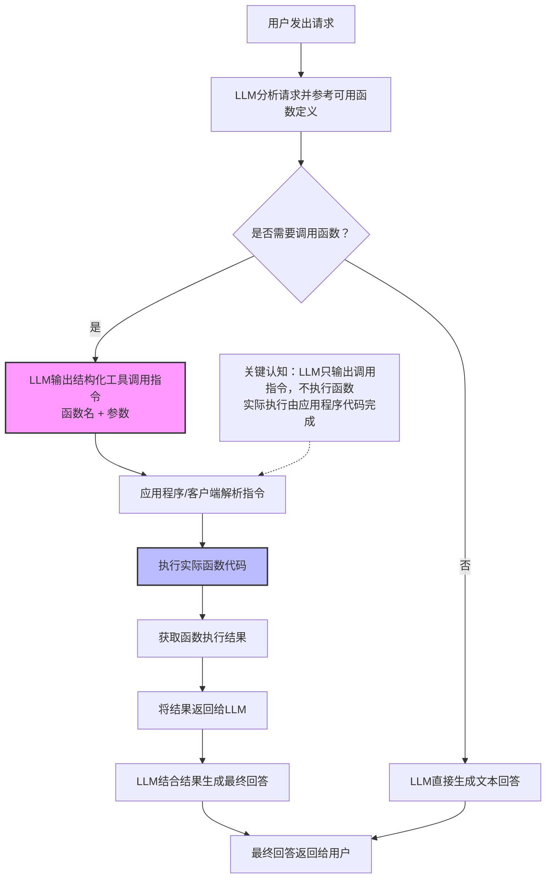
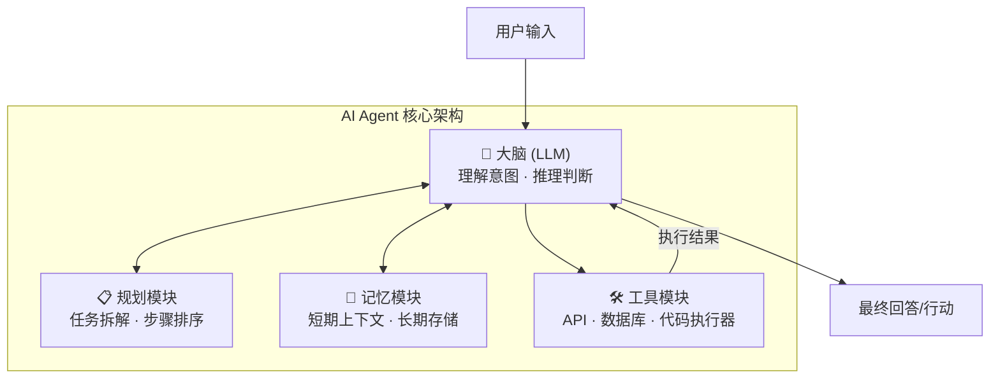

## LLM 是什么
LLM（大语言模型）本质上基于海量数据进行学习的一个条件概率模型，给它一段输入 token，它预测下一个 token 最可能是什么：
你可以把它当成一个无状态的函数：输入 Prompt，输出文本。每次调用都是独立的，没有记忆，没有状态，对外部世界一无所知。
LLM 就是一个只会不断「猜下一个字」的超级概率计算器， 本身无状态、无记忆、无认知，所有智能都来自海量文本的统计规律。
### LLM 自身的局限性

1. **没有真实理解、认知与语义能力**
   - 本质是统计概率拟合，并非真正“看懂、听懂、思考”。
   - 不了解文字背后对应的真实世界事物、因果关系及物理规则。
   - 仅模仿人类语言规律、句式及知识排列，知其然而不知其所以然。

2. **天生无状态、无记忆、无自我**
   - 模型本身为纯函数（输入 → 输出），无全局变量、无持久化存储。
   - 对话记忆依赖应用层拼接历史上下文实现，非模型原生能力。
   - 缺乏自我意识、主观想法、情感及连续思维。

3. **强上下文依赖，存在窗口上限**
   - 所有需利用的历史内容必须全部填入 Prompt。
   - 上下文窗口有限（如 4k/8k/128k），超长历史会导致截断或遗忘前文。
   - 上下文越长，推理成本、显存占用及耗时呈线性增长。

4. **逻辑薄弱，数学与推理存在短板**
   - 训练数据主要为“语言文本”，而非严谨的数理逻辑。
   - 在简单加减、多步推理及复杂逻辑链中极易出错。
   - 容易跳步或脑补答案，缺乏验算、推导及自我纠错能力。

5. **幻觉问题严重（最致命短板）**
   - 为确保文本流畅、通顺、连贯，可能自动编造内容。
   - 常虚构参考文献、日期、数据、接口、函数或专业结论。
   - 可能一本正经地输出完全错误的事实，且无法自我辨别真假。

6. **无法实时联网，无法感知外部世界**
   - 训练数据为静态离线数据集，存在知识截止时间。
   - 不了解实时新闻、动态数据、当前时间及业务实时状态。
   - 不能主动获取外部信息，仅能依赖“旧数据”。

7. **易受输入引导，顺从性过强**
   - 倾向于顺着用户话术走，无条件迎合提问。
   - 易被诱导生成违规内容、错误结论或恶意文案。
   - Prompt 若稍显模糊或带有误导性，输出结果极易跑偏。

8. **缺乏工具能力，无法直接执行动作**
   - 仅能生成文本，无法直接操作系统、数据库、接口或文件。
   - 不具备计算、查库、调用接口或操作系统的能力。
   - 需额外封装（如 Function Call / 工具调用 / 插件）才能联动外部能力。

9. **输出不可靠、不稳定且随机性强**
   - 相同问题与提示下，多次回答的内容可能不一致。
   - 在敏感、专业或工业场景中，输出结果难以控制。
   - 温度值（temperature）越高，发散性越强，越容易胡编乱造。

10. **无法精准记忆细节，易遗漏关键信息**
    - 对数字、ID、编码、长串字符及精准参数的记忆能力极差。
    - 在长对话中，容易忽略早期的关键约束或前置条件。
    - 面对复杂业务规则或多条件限制时，极易遗漏部分条件。

### 解决LLM自身局性的方式
#### Function Calling
函数调用（Function Calling）是 LLM 处理复杂任务时的核心解决方案，旨在弥补模型自身的局限性：
Function Call 是让 LLM 输出结构化的工具调用指令，而非普通文本，再由应用程序实际执行。
关键认知：LLM 自己并不执行函数！ 它只告诉你"我想调用什么函数、传什么参数"，真正执行的是你的代码。
- **弥补信息滞后**：通过联网工具获取实时信息。
- **增强逻辑计算**：借助代码执行工具解决数学与推理短板。
- **连接外部业务**：利用数据库或接口工具交互真实世界数据。

**核心分工**：
1. **LLM**：仅负责决策调用哪个函数，并提取/填充参数。
2. **代码层**：承担实际的逻辑计算、I/O 操作及接口请求。
```python
from openai import OpenAI
import json
import os

# ======================
# 初始化 OpenAI 客户端
# ======================
client = OpenAI(
    api_key="你的API_KEY",  # 替换成你的 key
    base_url="https://api.openai.com/v1"  # 国内可替换成中转地址
)

# ======================
# 1. 定义本地工具函数
# ======================
def get_current_weather(city: str) -> str:
    """查询天气"""
    weather_data = {
        "北京": "晴天，26℃，微风",
        "上海": "多云，28℃",
        "广州": "小雨，32℃",
        "深圳": "阴天，30℃"
    }
    return json.dumps({
        "city": city,
        "weather": weather_data.get(city, "未知城市")
    }, ensure_ascii=False)


def calculate(a: float, b: float, operator: str) -> str:
    """计算器"""
    if operator == "+":
        res = a + b
    elif operator == "-":
        res = a - b
    elif operator == "*":
        res = a * b
    elif operator == "/":
        res = a / b if b != 0 else "除数不能为0"
    else:
        res = "不支持的运算符"

    return json.dumps({
        "expression": f"{a}{operator}{b}",
        "result": res
    }, ensure_ascii=False)


# ======================
# 2. 函数映射表
# ======================
available_functions = {
    "get_current_weather": get_current_weather,
    "calculate": calculate
}

# ======================
# 3. 定义工具描述（给LLM看）
# ======================
tools = [
    {
        "type": "function",
        "function": {
            "name": "get_current_weather",
            "description": "根据城市名查询当前天气",
            "parameters": {
                "type": "object",
                "properties": {
                    "city": {
                        "type": "string",
                        "description": "城市名称，例如：北京"
                    }
                },
                "required": ["city"]
            }
        }
    },
    {
        "type": "function",
        "function": {
            "name": "calculate",
            "description": "进行加减乘除计算",
            "parameters": {
                "type": "object",
                "properties": {
                    "a": {"type": "number"},
                    "b": {"type": "number"},
                    "operator": {"type": "string", "enum": ["+", "-", "*", "/"]}
                },
                "required": ["a", "b", "operator"]
            }
        }
    }
]

# ======================
# 4. 主流程：对话 + 自动函数调用
# ======================
def chat_with_function_call(user_query: str):
    # 构造对话历史
    messages = [
        {"role": "user", "content": user_query}
    ]

    # 第一次请求 LLM：判断是否需要调用工具
    response = client.chat.completions.create(
        model="gpt-3.5-turbo",
        messages=messages,
        tools=tools,
        tool_choice="auto"
    )

    # 获取 LLM 回复
    response_message = response.choices[0].message
    tool_calls = response_message.tool_calls

    # 如果 LLM 不需要调用工具，直接返回
    if not tool_calls:
        print("✅ LLM直接回答：", response_message.content)
        return

    # ======================
    # 执行 LLM 指定的函数
    # ======================
    for tool_call in tool_calls:
        function_name = tool_call.function.name
        function_args = json.loads(tool_call.function.arguments)

        print(f"🔧 LLM调用函数：{function_name}, 参数：{function_args}")

        # 执行本地函数
        function_response = available_functions[function_name](**function_args)
        print(f"✅ 函数返回结果：{function_response}")

        # 把函数结果加入对话
        messages.append(response_message)  # 加入模型返回
        messages.append({
            "role": "tool",
            "tool_call_id": tool_call.id,
            "content": function_response
        })

    # ======================
    # 第二次请求 LLM：让模型整理最终答案
    # ======================
    second_response = client.chat.completions.create(
        model="gpt-3.5-turbo",
        messages=messages
    )

    print("\n🤖 LLM最终回答：", second_response.choices[0].message.content)


# ======================
# 测试
# ======================
if __name__ == "__main__":
    # 测试1：查询天气
    chat_with_function_call("北京今天天气怎么样？")

    # 测试2：计算器
    # chat_with_function_call("3.14 加 5.66 等于多少？")
```

#### MCP
个人认为MCP（Model Context Protocol）和 Function Calling 确实有紧密联系，MCP 是在 Function Calling 之上构建的一套标准化、可互操作的协议层以及能力的扩充。

---

##### 核心区别

| 维度 | Function Calling | MCP（Model Context Protocol） |
|------|----------------|------------------------------|
| **定位** | LLM 输出结构化调用指令的基本能力 | 统一管理 LLM 与外部工具、数据源交互的协议 |
| **粒度** | 单次“函数名+参数”的指令 | 支持工具调用、资源访问、提示模板等多种交互模式 |
| **标准化** | 各厂商实现细节不同（OpenAI/Anthropic/通义等） | 基于 JSON-RPC 的开放协议，客户端/服务器可跨平台 |
| **会话管理** | 无状态，每次调用需传入完整函数定义 | 支持有状态会话、资源订阅、流式传输 |
| **上下文增强** | 仅工具调用 | 可主动暴露“资源”（文件、数据库、API 等）作为上下文 |

---

##### 关系类比
- Function Calling 就像是“让 LLM **可以喊出**函数名和参数”的**底层能力**。
- MCP 则是一个**插孔和插头标准**，统一了 LLM 如何发现工具、如何安全调用、如何传递参数、如何处理结果、如何管理多轮对话中的上下文。

因此：**MCP 可以看作是 Function Calling 的“协议化与生态化升级”**，但两者不是替代关系 —— MCP 的实现通常依赖 LLM 本身具备 Function Calling 能力，只是在这之上封装了更丰富的交互规范。

---

##### 举例说明

- **纯 Function Calling**：你告诉 LLM 有 `get_weather(city)` 函数，LLM 输出 `{"name":"get_weather","arguments":{"city":"Beijing"}}`，你自己写代码去执行。
- **MCP**：启动一个 MCP 服务器，它声明了 `get_weather` 工具，并提供输入输出 schema。客户端（如 Claude Desktop）通过协议与服务器通信，LLM 可以直接使用服务器上的工具，并能够访问服务器提供的“资源”（如实时数据库），还支持多轮对话中自动保持上下文。

---

##### 总结
- 如果你只是需要偶尔让 LLM 调用几个自定义函数 → **Function Calling 足够**。
- 如果你构建的是复杂 Agent 系统，需要连接多个外部数据源、工具，并希望有统一的交互与安全管理 → **MCP 是更好的抽象**。
- 所以，**MCP 不是 Function Calling 的直接升级，而是 Function Calling 的“协议层规范”和“生态扩展”**，使得多种 LLM 和多种工具可以无缝协作。

#### Skills 与 Prompt
##### Skills
Skills（Anthropic 于 2025 年 10 月推出的官方功能）可理解为一个“专家级操作手册”。是一种特殊的 Prompt，用于描述一个工具或任务的执行步骤、输入参数、输出结果。适合封装可复用的领域专家知识和工作流程，让 Agent 在遇到特定任务时自动或手动加载执行，避免 System Prompt 无限膨胀。
##### Prompt
Prompt 是 LLM 输入，用于描述任务、环境、上下文、工具、数据源、API 等，让 LLM 输出结果。
以下是 **Skills** 与 **Prompt**（以 System Prompt 为代表，涵盖 User Prompt 中的即时指令）的详细对比：
##### Skills 与 Prompt 对比
| 对比维度 | Skills | Prompt（System / User） |
|---------|--------|--------------------------|
| **定义** | 结构化的能力包，包含 `SKILL.md`（元数据+指令）+ 可选脚本/资源 | 自然语言指令，直接写在 System Prompt 或 User Prompt 中 |
| **作用范围** | 按需激活，仅特定场景触发 | 全局（System Prompt）或单次请求（User Prompt） |
| **加载方式** | 渐进式披露：先加载`name+description`，匹配任务后才加载完整内容 | 每次请求都完整加载到上下文中 |
| **上下文占用** | 低（元数据仅几 token），激活时才消耗额外 token | 高（System Prompt 动辄上千 token，始终占用） |
| **可复用性** | 高：一次编写，多项目/多 Agent 共享 | 低：需手动复制粘贴，难以版本管理 |
| **可维护性** | 模块化，每个 Skill 独立目录，易于增删改 | 随功能增多变得臃肿、相互干扰，维护困难 |
| **激活方式** | 自动匹配（模型判断）或手动调用（`/skill名`） | 每次对话自动生效（System），或用户显式发送（User） |
| **携带脚本** | 可以包含可执行代码（Python/Bash 等），模型可调用执行 | 无，仅文本指令，无法直接执行动作 |
| **典型用途** | 封装领域专家流程：代码审查规范、SQL 最佳实践、品牌语气指南 | 设定助手人格、通用安全边界、一次性任务指令 |
| **版本控制** | 可放入 Git，团队协作，支持迭代 | 依赖外部文档或注释，难以工程化管理 |
#### 总结
##### 🔧 Function Call vs MCP vs Skills 三维对比（补充版）

| 维度 | Function Call | MCP（Model Context Protocol） | Skills |
|------|---------------|-------------------------------|--------|
| **一句话定位** | 决定「怎么调」 | 决定「用什么」 | 决定「怎么想」 |
| **解决的问题** | LLM 如何调用外部函数 | LLM 如何标准化接入外部工具/数据源 | 领域专业知识如何编码并注入 LLM |
| **运行位置** | 你的应用程序（客户端执行实际函数） | MCP Server 独立进程，客户端通过协议通信 | Agent 的上下文窗口（渐进式加载） |
| **技术本质** | API 协议/格式约束（如 JSON Schema） | 基于 JSON-RPC 的通信标准 | 提示词扩展 + 元数据 + 可选脚本 |
| **是否涉及外部调用** | 是（应用程序执行函数后返回结果） | 是（MCP Server 执行工具或提供资源） | 否（仅改变 LLM 的思考和行为模式） |
| **标准化程度** | 各厂商不统一（OpenAI/Anthropic/通义各有差异） | 开源开放协议，正在形成统一标准 | 各平台各有实现（Anthropic Skills、LangChain 自定义提示包等） |
| **何时生效** | LLM 输出 function call 结构时 | 模型通过 MCP 客户端发起请求时 | 模型判断场景匹配后，加载到上下文时 |
| **典型例子** | `get_weather(city)` | 连接数据库、文件系统、Slack API | 代码审查清单、SQL 最佳实践、品牌语气指南 |

---

##### 🧩 三者协作关系图

```text
用户请求：“审查这段代码的安全问题”
         │
         ▼
┌─────────────────────────────────────────────┐
│   Skills（怎么想）                            │
│   → 加载“代码审查专家”技能包                   │
│   → 内置安全规范：避免 SQL 注入、XSS 等        │
└─────────────────────────────────────────────┘
         │
         ▼
┌─────────────────────────────────────────────┐
│   MCP（用什么）                               │
│   → 发现可用工具：read_file、search_web      │
│   → 连接代码仓库、知识库                       │
└─────────────────────────────────────────────┘
         │
         ▼
┌─────────────────────────────────────────────┐
│   Function Call（怎么调）                     │
│   → 输出 { “name”: “read_file”, “arguments”:  │
│            { “path”: “src/auth.js” } }       │
│   → 应用程序实际执行该函数                     │
└─────────────────────────────────────────────┘
         │
         ▼
      执行结果返回 LLM → 生成最终审查报告
```

---

| 概念 | 核心问题 | 类比 |
|------|----------|------|
| **Skills** | 应该用什么标准和流程思考？ | 员工手册、专家经验库 |
| **MCP** | 能访问哪些外部系统和数据？ | 接口插头、设备驱动 |
| **Function Call** | 具体某个工具如何被调用？ | API 调用语法、函数签名 |

> **三者叠加**：Skills 让 Agent 知道“怎么做是对的”，MCP 让 Agent 知道“能用什么”，Function Call 让 Agent 能把想法变成实际动作。缺一不可，协同构成真正的自主智能体。


### Agent
Agent 是一个智能代理（如Claude Code），它可以通过与外部工具、数据源、API 进行交互，来帮助用户完成各种任务。Agent 作为入口与用户交互，底层管理 LLM , 以及与外部工具、数据源进行交互。
Agent 由四个模块组合而成：LLM（大脑）负责理解意图、推理判断；规划模块负责任务拆解、步骤排序；记忆模块负责短期上下文与长期知识存储；工具模块负责调用外部 API、数据库、代码执行器等，是 Agent 的"手和脚"。



https://mp.weixin.qq.com/s/eE8PHFRXyTirRMrlJDyZGg?from=singlemessage&isappinstalled=0&scene=1&clicktime=1777298183&enterid=1777298183
https://uaxe.github.io/geektime-docs/AI-%E5%A4%A7%E6%95%B0%E6%8D%AE/AI%E9%87%8D%E5%A1%91%E4%BA%91%E5%8E%9F%E7%94%9F%E5%BA%94%E7%94%A8%E5%BC%80%E5%8F%91%E5%AE%9E%E6%88%98/02-Agent%E7%9A%84%E5%8E%9F%E7%90%86%EF%BC%9A%E4%BB%80%E4%B9%88%E6%98%AFAI%20Agent%EF%BC%9F/

